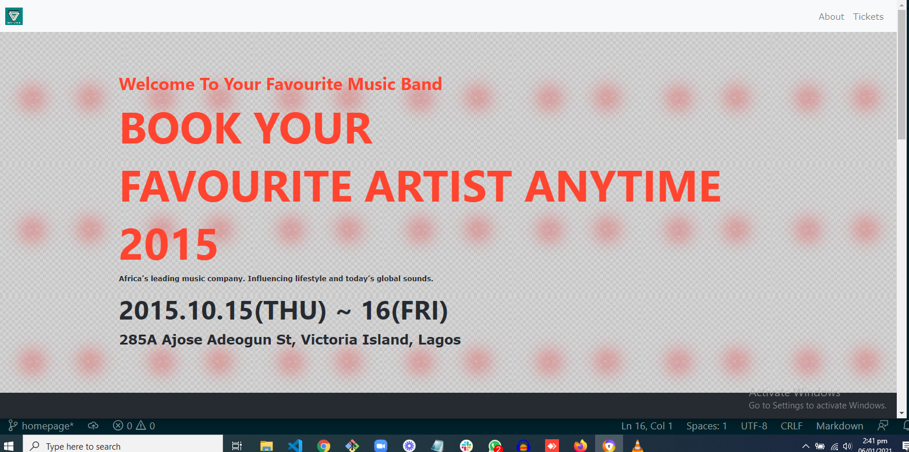

# Conference-Page

# Getting started :
This website can be viewed better on the screen size of of 1920 X 1080 in the firefox browser or chrome.
you can also download the repo and open the ''index.html" file with Mozilla Firefox.

In this project, I built a conference page using the (https://www.behance.net/gallery/29845175/CC-Global-Summit-2015) as a theme in building the project. I made a musical band website, where different music lovers can book sessions for various parties and occasions with thier favorite African musicians. 

## BUILT WITH
-HTML

-CSS

-BOOTSTRAP

## LIVE DEMO
[Live Demo Link](https://diamond-nicholas.github.io/Conference-Page--Capstone/)

[Video Presentation](https://www.loom.com/share/188045a4474f45439dcbd6ceec7dd757)

## AUTHORS
👤 **Diamond Nicholas**
- GitHub:[@Diamond-Nicholas] (https://github.com/diamond-nicholas) 
- Twitter: [@twitterhandle](https://twitter.com/diamondnich)
- LinkedIn: [LinkedIn](https://www.linkedin.com/in/diamond-nicholas/)

## SHOW YOUR SUPPORT
Give a \* if you like the project

## 🤝 Contributing
Contributions, issues, and feature requests are welcome!
Feel free to check the issues page. Show your support
Give a ⭐️ if you like this project!

## Acknowledgments
- https://www.behance.net/gallery/29845175/CC-Global-Summit-2015

## 📝 License MIT
This project is [MIT](./LICENSE) licensed.

Microverse Capstone Project